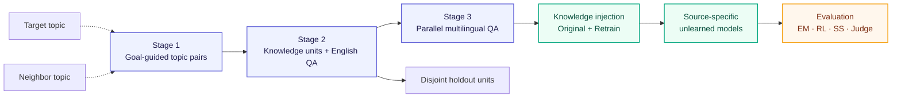
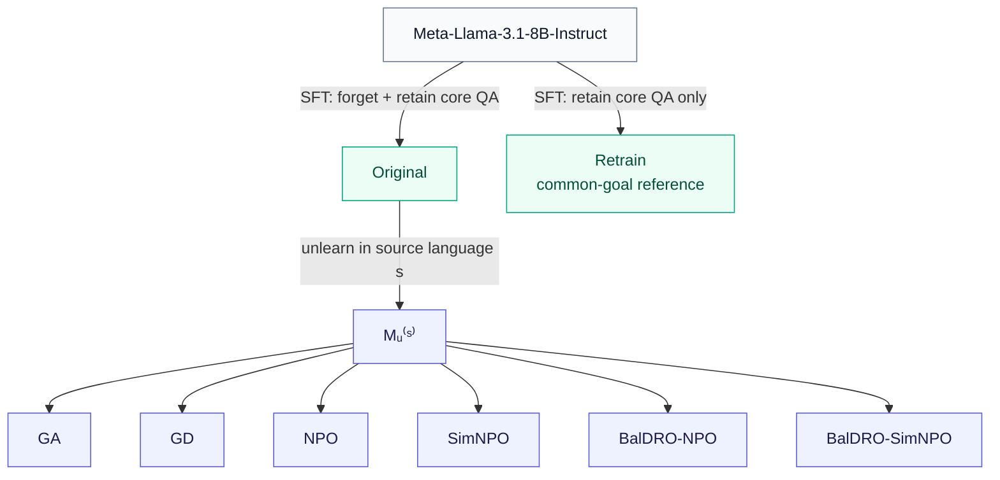

<div align="center">

# CLLPU

### Beyond Cross-Lingual Transfer

**Benchmarking propagation boundaries in multilingual LLM unlearning**

[](#benchmark-snapshot)
[](#benchmark-snapshot)
[](#benchmark-snapshot)
[](#evaluation)

[Pipeline](#benchmark-pipeline) ·
[News](#news) ·
[Data](data/) ·
[Models](unlearned_models/) ·
[Evaluation](evaluation/) ·
[Quick start](#quick-start)

</div>

---

> **CLLPU evaluates not only whether knowledge is forgotten, but whether the forgetting effect stops at the intended linguistic boundary.**

## About this repository

This repository provides the official data, construction pipeline, model protocol, and evaluation toolkit for **CLLPU (Cross-Lingual and Language-Bound Protocol for LLM Unlearning)**. CLLPU frames multilingual unlearning as a propagation-boundary problem: a method must remove designated knowledge where forgetting is required, preserve closely related knowledge, and control whether the effect should propagate across languages or remain confined to one language context. The benchmark contains 72,000 QA instances in ten languages, built from relation-matched forget-retain knowledge pairs, and evaluates source-specific unlearned models with EM, ROUGE-L, BGE-M3 sentence similarity, and LLM-as-a-Judge.

## News

- **2026-07-28** — Reorganized the repository around the paper pipeline: Stage 1, Stage 2, Stage 3, Unlearned Models, and Evaluation.
- **2026-07-28** — Released a unified four-metric evaluation interface with complete source × evaluation-language matrices and Source/Cross/Overall numeric exports.
- **Coming next** — Training runtime, checkpoint manifests, and selected unlearned model artifacts.

## Why CLLPU?

Cross-lingual transfer alone does not tell us whether an unlearning method behaved correctly. The desired behavior depends on the request:

| Common-goal forgetting | Language-conditioned forgetting |
|---|---|
| Forget the target knowledge in **every language**. | Forget the target knowledge **only in the designated source language**. |
| Cross-lingual propagation is required. | Cross-lingual propagation must be contained. |
| `Forget Source ↓` · `Forget Cross ↓` | `Forget Source ↓` · `Forget Cross ↑` |
| `Retain Source ↑` · `Retain Cross ↑` | `Retain Source ↑` · `Retain Cross ↑` |

This distinction exposes two opposite failure modes: insufficient propagation when universal suppression is required, and excessive propagation when forgetting should remain language-bound.

## Benchmark pipeline



| Step | What it does | Entry |
|---:|---|---|
| **01** | Pair target and neighboring topics under the intended forgetting goal | [Stage 1 guide](stage_1_topic_pairs/) |
| **02** | Extract atomic facts, relation-match forget/retain units, create English QA families | [Stage 2 guide](stage_2_knowledge_to_qa/) |
| **03** | Translate with dual anchors, back-translate, verify, and audit | [Stage 3 guide](stage_3_multilingual_translation/) |
| **04** | Build Original, Retrain, and source-specific unlearned checkpoints | [Model protocol](unlearned_models/) |
| **05** | Export accessibility matrices and final Source/Cross values | [Evaluation guide](evaluation/) |

The stage directories form the public documentation layer. Executable construction scripts remain in [`code/`](code/), and released artifacts remain in [`data/`](data/) to preserve stable paths and caches.

## Benchmark snapshot

<div align="center">

| **10** languages | **80** topic pairs | **800** matched pairs | **72K** QA instances |
|:---:|:---:|:---:|:---:|
| `ar bn de en es fr ja sw th zh` | 50 common + 30 conditioned | 500 common + 300 conditioned | 64K matched + 8K holdout |

</div>

### Two benchmark tracks

| Setting | Topic pairs | Forget-retain pairs | QA per pair / language | Total matched QA |
|---|---:|---:|---:|---:|
| Common-goal | 50 | 500 | 8 | 40,000 |
| Language-conditioned | 30 | 300 | 8 | 24,000 |
| **Total** | **80** | **800** |  | **64,000** |

Each matched pair contributes:

```text
2 roles × (1 core QA + 3 surface variants) × 10 languages = 80 QA instances
```

An additional 500 common-goal and 300 language-conditioned holdout units contribute one core QA in every language:

```text
64,000 matched QA + 8,000 holdout QA = 72,000 total QA instances
```

> [!NOTE]
> Existing filenames use `.culture_specific` for the paper's **language-conditioned** track. The legacy suffix is retained to avoid breaking scripts and released artifacts.

## Quick start

### 1. Install

```powershell
git clone https://github.com/CLLPU/CLLPU-bench.git
cd CLLPU-bench

python -m venv .venv
.\.venv\Scripts\Activate.ps1
python -m pip install -r requirements.txt
```

### 2. Use the released benchmark

Canonical multilingual QA files are already committed:

```text
data/qa_variants.<language>.json
data/qa_variants.<language>.culture_specific.json
```

See the [data guide](data/) for canonical files, construction intermediates, caches, and failure artifacts.

### 3. Evaluate model generations

```powershell
python evaluation/evaluate_em.py generations.jsonl
python evaluation/evaluate_rouge_l.py generations.jsonl
python evaluation/evaluate_sentence_similarity.py generations.jsonl
python evaluation/evaluate_llm_judge.py generations.jsonl --model YOUR_JUDGE_MODEL
```

Every evaluator exports numeric results only:

```text
per_qa.jsonl
per_knowledge.csv
heatmap_values.csv
heatmap_matrices.json
overall.csv
overall.json
```

No plotting library is required, and no heatmap image is generated.

<details>
<summary><b>Rebuild the benchmark data</b></summary>

Stage 1 - collect the curated Wikipedia pages:

```powershell
python code/step2_collect_wiki_pages.py --help
```

Stage 2 - extract, match, select, and instantiate knowledge:

```powershell
python code/step3_extract_knowledge_cards.py --help
python code/step4_construct_relation_matched_pairs.py --help
python code/step4_5_select_high_quality_pairs.py --help
python code/step5_generate_qa_variants.py --help
python code/step_holdout_generate_qa.py --help
```

Stage 3 - translate and verify one target language per run:

```powershell
python code/step6_expand_qa_translations.py --language zh
python code/step_holdout_expand_qa_translations.py --language zh
python code/review_step6_translation_quality.py --help
```

LLM-assisted scripts read `config/llm_api.env` by default. Never commit credentials. Check each command with `--help` before a production run.

</details>

## Models and unlearning

The benchmark targets `Meta-Llama-3.1-8B-Instruct`.



For each setting, method, and source language, the selected checkpoint is evaluated in all ten query languages. A full release therefore contains:

```text
2 settings × 6 methods × 10 source languages = 120 unlearned checkpoints
```

Checkpoint identity, required manifests, and current reproducibility gaps are documented in the [model protocol](unlearned_models/).

## Evaluation

CLLPU supports four knowledge-accessibility metrics:

| Metric | Measures | Output range |
|---|---|---:|
| **EM** | normalized exact answer equality | `0` or `1` per QA |
| **RL** | multilingual ROUGE-L F1 | `[0, 1]` |
| **SS** | BGE-M3 cosine similarity | cosine similarity |
| **LLM-as-a-Judge** | factual correctness judged from question and answer | `0` or `1` per QA |

For metric `m`, role `z`, source language `s`, and evaluation language `t`:

```text
QA scores
  → mean within each knowledge unit
  → Aᵐ_z(s,t), one source × evaluation-language cell
  → Source / Cross / Overall macro averages
```

The matrix diagonal is the **Source** scope (`t = s`); off-diagonal cells are the **Cross** scope (`t ≠ s`).

| Setting | Forget Source | Forget Cross | Retain Source | Retain Cross |
|---|:---:|:---:|:---:|:---:|
| Common-goal | ↓ | ↓ | ↑ | ↑ |
| Language-conditioned | ↓ | ↑ | ↑ | ↑ |

See the [evaluation guide](evaluation/) for the normalized generation schema, exact aggregation contract, and output files.

## Data conventions

| Paper term | Repository field / filename |
|---|---|
| forget unit | `target` |
| retain unit | `neighbor` |
| common-goal | default files / `common` |
| language-conditioned | `.culture_specific` |
| Source | matrix diagonal, `t = s` |
| Cross | matrix off-diagonal, `t ≠ s` |

Holdout units are knowledge-disjoint non-members. They must not be used during knowledge injection or unlearning.

## Repository layout

```text
CLLPU-bench/
├── stage_1_topic_pairs/               # goal-guided topic pairing
├── stage_2_knowledge_to_qa/           # knowledge units and English QA
├── stage_3_multilingual_translation/  # dual-anchor multilingual QA
├── unlearned_models/                  # model lineage and manifests
├── evaluation/                        # EM, RL, SS, LLM-as-a-Judge
├── code/                              # executable construction scripts
├── data/                              # benchmark release and intermediates
├── research_notes/                    # design history
└── tmp/                               # local intermediate files
```

## Reproducibility status

| Component | Status |
|---|---|
| Benchmark data | Available in `data/` |
| Stage 1-3 construction scripts | Available in `code/` |
| Four evaluation scripts | Available in `evaluation/` |
| Numeric matrix export | Available |
| Model training runtime | Referenced as `open-unlearning-main`; not yet vendored |
| Selected model weights/manifests | Pending public artifact release |

The current checkout fully exposes benchmark construction, released data, and metric aggregation. End-to-end checkpoint reproduction will be complete once the training runtime and selected checkpoint manifests are published.

---

<div align="center">

**CLLPU · Cross-Lingual and Language-Bound Protocol for LLM Unlearning**

[Back to top](#cllpu)

</div>
