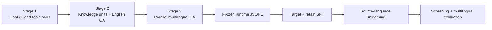

<div align="center">

# CLLPU

### Beyond Cross-Lingual Transfer

**Benchmarking propagation boundaries in multilingual LLM unlearning**

[](#benchmark-snapshot)
[](#benchmark-snapshot)
[](#unlearning)
[](#evaluation)

[Pipeline](#benchmark-pipeline) ·
[Data](data/) ·
[Runtime](#runtime-workflow) ·
[Evaluation](#evaluation) ·
[Quick start](#quick-start)

</div>

---

> **CLLPU evaluates not only whether knowledge is forgotten, but how the
> forgetting effect propagates across languages.**

## About This Repository

CLLPU is a benchmark and reference runtime for cross-lingual LLM unlearning.
It covers Arabic, Bengali, German, English, Spanish, French, Japanese,
Swahili, Thai, and Chinese. The repository contains the established benchmark
construction resources, the frozen training/evaluation snapshot, and the
OpenUnlearning-derived runtime used for target-model SFT, retain-reference SFT,
six unlearning methods, checkpoint screening, multilingual evaluation, and
result export.

The active runtime does not include model weights, generated outputs, W&B
logs, API responses, automatic Pareto deletion, TOFU, MUSE, relative R/T/D
metrics, or response-language experiments.

## What the Runtime Provides

| Capability | Implementation |
| --- | --- |
| Model preparation | Target-model SFT and independently initialized retain-reference SFT |
| Unlearning settings | Common and Culture-origin |
| Methods | GradAscent, GradDiff, NPO, SimNPO, DrNPO, DrSimNPO |
| Checkpoint screening | Source-language-only Exact and ROUGE-L during training |
| Post-selection evaluation | Common, one Culture origin, or unified multilingual full evaluation |
| Optional metrics | Pinned BGE-M3, five-level semantic judge, source-language MIA, ten-language Belebele |
| Result export | One-method long CSV and partial or complete source-by-evaluation-language matrices |

`DrNPO` and `DrSimNPO` are the runtime names of the BalDRO-DV variants. Result
tables should use one consistent paper name and retain the CLI identifiers
`drnpo` and `drsimnpo` in machine-readable metadata.

## Benchmark Pipeline



The existing construction resources remain under
[`stage_1_topic_pairs/`](stage_1_topic_pairs/),
[`stage_2_knowledge_to_qa/`](stage_2_knowledge_to_qa/),
[`stage_3_multilingual_translation/`](stage_3_multilingual_translation/), and
[`code/`](code/). The model runtime consumes the reviewed files under
[`runtime/data/multilingual/`](runtime/data/multilingual/) and does not rebuild
them during an experiment.

## Benchmark Snapshot

| Setting | Topic pairs | Forget-retain pairs | Matched QA |
| --- | ---: | ---: | ---: |
| Common | 50 | 500 | 40,000 |
| Culture-origin | 30 | 300 | 24,000 |
| **Total** | **80** | **800** | **64,000** |

The unified full evaluation contains 64,000 target/neighbor core+surface
records. An additional 8,000 core holdout records support MIA, giving 72,000
QA instances in the complete benchmark release. MIA holdouts are excluded from
ordinary full evaluation.

Existing source filenames use `.culture_specific`; the runtime calls the
corresponding experimental unit a Culture origin. This legacy field and
filename are retained for data compatibility.

## Runtime Workflow

```text
Official Meta Llama 3.1 Instruct
  -> Target-model SFT / Retain-reference SFT
  -> Common or Culture-origin unlearning
  -> source-language Exact/ROUGE checkpoint screening
  -> checkpoint selection
  -> standalone multilingual generation and Exact/ROUGE evaluation
     -> optional BGE-M3 and semantic scoring of saved generations
     -> optional source-language MIA checkpoint evaluation
     -> optional ten-language Belebele checkpoint evaluation
  -> one-method CSV and source-by-evaluation-language matrix export
```

Training-time screening never includes cross-language results. Multilingual
evaluation is a separate post-selection operation, so cross-language behavior
cannot influence the initial checkpoint screen.

## Quick Start

### Installation

The paper environment uses Python 3.11. `requirements.txt` records the pinned
direct Python dependencies; system drivers, CUDA toolkits, and compilers remain
machine-specific.

```bash
git clone https://github.com/CLLPU/CLLPU-bench.git
cd CLLPU-bench
python3.11 -m venv .venv
source .venv/bin/activate
python -m pip install --upgrade pip setuptools wheel
python -m pip install -r requirements.txt
python -m pip install -e . --no-deps
```

The installation also provides the equivalent `cllpu-train` and `cllpu-eval`
console entry points. The examples below use `python -m cllpu.train` and
`python -m cllpu.eval` so the invoked module is explicit.

Meta Llama 3.1 is gated. Accept its license and authenticate before use:

```bash
huggingface-cli login
```

The paper configuration uses `flash_attention_2`. For a portable smoke test,
explicitly override it with `model.model_args.attn_implementation=sdpa`; that
override is not the paper configuration.

### Runtime Data

The reviewed 72-file JSONL snapshot is already under
`runtime/data/multilingual`. To use an identical snapshot stored elsewhere:

```bash
export CROSS_LINGUAL_DATA_DIR=/path/to/data
```

The expected schema, layout, and counts are documented in
[`runtime/data/README.md`](runtime/data/README.md).

## Model Preparation

The canonical base configuration uses
`meta-llama/Meta-Llama-3.1-8B-Instruct` and the tested immutable revision in
[`runtime/configs/model/Llama-3.1-8B-Instruct.yaml`](runtime/configs/model/Llama-3.1-8B-Instruct.yaml).

### Target Model

The Target model is trained on all 16,000 Common+Culture target/neighbor core
records for five epochs with batch size 8 and gradient accumulation 4:

```bash
python -m cllpu.train \
  --config-name=train.yaml \
  experiment=finetune/multilingual/default \
  task_name=common_culture_target \
  paths.output_dir=outputs/finetune/common_culture_target \
  save_final_model=true
```

```bash
export CROSS_LINGUAL_TARGET_MODEL=outputs/finetune/common_culture_target
```

### Retain-Reference Model

The Retain-reference model is initialized independently from the same official
Meta base and trained on all 8,000 Common+Culture neighbor/core records:

```bash
python -m cllpu.train \
  --config-name=train.yaml \
  experiment=finetune/multilingual/retain_reference \
  task_name=common_culture_retain_reference \
  paths.output_dir=outputs/finetune/common_culture_retain_reference \
  save_final_model=true
```

Although its training data contains neighbor/core examples from both settings,
the Retain-reference model is used only as the Common-setting reference. It is
not used as a Culture-setting reference.

## Unlearning

### Common

The Common runner defaults to ten epochs, batch size 8, gradient accumulation
4, and the paper sweep ranges:

```bash
bash runtime/scripts/run_multilingual_unlearn_sweep.sh \
  --gpu 0 \
  --source-language en \
  --methods ga,gd,npo,simnpo,drnpo,drsimnpo \
  --finetuned-model "$CROSS_LINGUAL_TARGET_MODEL" \
  --output-root outputs/unlearn/common/en \
  --train-eval true
```

Use `--dry-run` to validate rendered commands. `--skip-existing` skips only a
successfully completed run whose command and resolved configuration/data roots
match exactly. W&B is opt-in with `--report-to wandb`.

### Culture-Origin

Culture-origin training uses ten epochs, batch size 4, and gradient
accumulation 2. Source language must equal the Culture origin:

```bash
bash runtime/scripts/run_multilingual_culture_origin_unlearn_sweep.sh \
  --culture-origin zh \
  --finetuned-model "$CROSS_LINGUAL_TARGET_MODEL" \
  --gpu 0 \
  --dry-run
```

Arabic uses 33 forget and 33 retain records, Bengali uses 27+27, and every
other origin uses 30+30. The runner supplies the corresponding source-monitor
counts automatically.

### Screening Protocol

With `--train-eval true`, every saved epoch is evaluated only in the language
being unlearned:

- Common: 4,000 source-language target/neighbor core+surface records.
- Culture: 264 records for Arabic, 216 for Bengali, and 240 otherwise.
- Metrics: strict Exact Match and multilingual ROUGE-L.
- Weighted value: `0.25 * core_mean + 0.75 * surface_mean`.

The weighted definition is equivalent to giving each of the one core and three
surface question forms weight 0.25. The runtime does not rank checkpoints,
compute a Pareto frontier, or delete model weights.

## Evaluation

### Standalone Model Evaluation

After selecting a checkpoint, run model inference separately. Common-only
evaluation covers 40,000 records:

```bash
python -m cllpu.eval \
  --config-name=eval.yaml \
  experiment=eval/multilingual/common \
  target_model=MODEL_ID_OR_CHECKPOINT \
  task_name=common_full_eval \
  paths.output_dir=outputs/eval/common_full_eval \
  eval.multilingual.output_dir=outputs/eval/common_full_eval
```

One Culture origin is evaluated across all ten languages. For Bengali:

```bash
python -m cllpu.eval \
  --config-name=eval.yaml \
  experiment=eval/multilingual/culture_origin \
  target_model=MODEL_ID_OR_CHECKPOINT \
  multilingual_culture_origin=bn \
  multilingual_culture_eval_expected_count=2160 \
  task_name=culture_bn_full_eval \
  paths.output_dir=outputs/eval/culture_bn_full_eval \
  eval.multilingual.output_dir=outputs/eval/culture_bn_full_eval
```

Use `2640` for Arabic and `2400` for every origin other than Arabic and
Bengali. Unified Common+all-Culture evaluation covers 64,000 records:

```bash
python -m cllpu.eval \
  --config-name=eval.yaml \
  experiment=eval/multilingual/default \
  target_model=MODEL_ID_OR_CHECKPOINT \
  task_name=unified_full_eval \
  paths.output_dir=outputs/eval/unified_full_eval \
  eval.multilingual.output_dir=outputs/eval/unified_full_eval
```

Each standalone run performs generation and writes `generations.jsonl`,
per-example Exact/ROUGE values, and `MULTILINGUAL_SUMMARY.json`.

### Saved-Generation Metrics

The following commands score an existing `generations.jsonl`. They do not load
the evaluated checkpoint or generate responses:

```bash
python runtime/scripts/evaluate_checkpoint_em.py generations.jsonl \
  --output-dir outputs/eval/em

python runtime/scripts/evaluate_checkpoint_rouge.py generations.jsonl \
  --output-dir outputs/eval/rouge

python runtime/scripts/evaluate_checkpoint_embedding.py generations.jsonl \
  --output-dir outputs/eval/embedding

python runtime/scripts/evaluate_checkpoint_llm_judge.py generations.jsonl \
  --output-dir outputs/eval/semantic
```

The embedding evaluator uses pinned dense BGE-M3. The semantic evaluator uses
the versioned prompt/schema and defaults to `gpt-5.6-luna`, Chat Completions,
temperature 0, no reasoning-effort override, 1,024 output tokens, and a
120-second timeout. Credentials are supplied through an environment variable;
compatible unauthenticated endpoints are supported explicitly.

The earlier `runtime/evaluation/evaluate_*.py` paths remain compatibility wrappers for
these same implementations. They do not define separate metrics.

### MIA and Belebele

MIA evaluates target/core members against core holdouts in the unlearned source
language only. Belebele evaluates zero-shot utility in all ten languages. Both
load a Hugging Face model ID or local checkpoint directly:

```bash
python runtime/scripts/run_mia_evaluation.py \
  --model MODEL_ID_OR_CHECKPOINT \
  --tokenizer TOKENIZER_ID_OR_PATH \
  --data-root runtime/data \
  --output-dir outputs/eval/mia/common/en \
  --dataset common \
  --source-language en

python runtime/scripts/run_belebele_utility.py \
  --model MODEL_ID_OR_CHECKPOINT \
  --tokenizer meta-llama/Meta-Llama-3.1-8B-Instruct \
  --tokenizer-revision 0e9e39f249a16976918f6564b8830bc894c89659 \
  --output-dir outputs/eval/belebele
```

The fixed paper defaults are encoded by the corresponding scripts: BGE-M3 uses
`BAAI/bge-m3` at revision
`5617a9f61b028005a4858fdac845db406aefb181`; MIA uses loss,
zlib-normalized loss, Min-K, and Min-K++ with `k=0.4`, maximum length 512, and
batch size 32; Belebele uses `facebook/belebele` at revision
`7899cdfa4e1e0d733fd77c848e2c273cb1d32be2`, zero-shot evaluation, and batch
size 16. Run each script with `--help` for its complete interface.

### Result Export

[`runtime/scripts/export_cross_language_matrix.py`](runtime/scripts/export_cross_language_matrix.py)
exports one absolute metric for exactly one method per invocation. It supports
one or more uniquely identified checkpoints. One selected source checkpoint
evaluated in all languages produces ten long-table rows; ten source
checkpoints produce 100 rows and a complete 10-by-10 method matrix.

The exporter supports `a_exact`, `a_rouge`, `a_embed_cosine_bge_m3`, and
`a_semantic`, validates Common/Culture isolation and equal-four-form weights,
and does not calculate relative R/T/D or perform checkpoint selection. See
the following one-checkpoint example:

```bash
python runtime/scripts/export_cross_language_matrix.py \
  --input-root outputs/eval/common_selected \
  --path-template '{source_language}/{method}/MULTILINGUAL_SUMMARY.json' \
  --source-languages en \
  --method simnpo \
  --dataset common \
  --experiment common_selected \
  --language-scope all \
  --metric a_rouge \
  --topic-role target \
  --variant weighted \
  --output outputs/exports/simnpo_en_target_rouge.csv \
  --matrix-output-dir outputs/exports/simnpo_en_target_rouge_matrix
```

Use an input-index CSV for arbitrary result locations or multiple checkpoints;
run the exporter with `--help` for that schema and all supported options.

## Repository Layout

```text
CLLPU-bench/
├── runtime/                           # all active training/evaluation code
│   ├── configs/                       # canonical Hydra configuration
│   ├── data/multilingual/              # frozen 72-file runtime snapshot
│   ├── evaluation/                    # compatibility metric entry points
│   ├── scripts/                       # supported workflows
│   ├── src/cllpu/                    # installable Python package
│   └── tests/                         # protocol and metric tests
├── data/                              # construction data and provenance
├── stage_1_topic_pairs/               # existing construction documentation
├── stage_2_knowledge_to_qa/
├── stage_3_multilingual_translation/
├── code/                              # existing construction programs
└── outputs/                           # generated and Git-ignored runtime artifacts
```

See [`runtime/README.md`](runtime/README.md) for the code boundary and entry
points. Commands are run from the repository root so the default
`runtime/data/` and `outputs/` paths remain stable.

## Reproducibility

Install development checks and run:

```bash
python -m pip install -e '.[dev]'
pytest -q
ruff check .
bash -n runtime/scripts/run_multilingual_unlearn_sweep.sh
bash -n runtime/scripts/run_multilingual_culture_origin_unlearn_sweep.sh
```

Archive the exact code commit, data checksums, model/tokenizer revisions, Hydra
overrides, random seed, and protocol outputs for reported results.

---

<div align="center">

**CLLPU · Cross-Lingual and Language-Bound Protocol for LLM Unlearning**

[Back to top](#cllpu)

</div>
