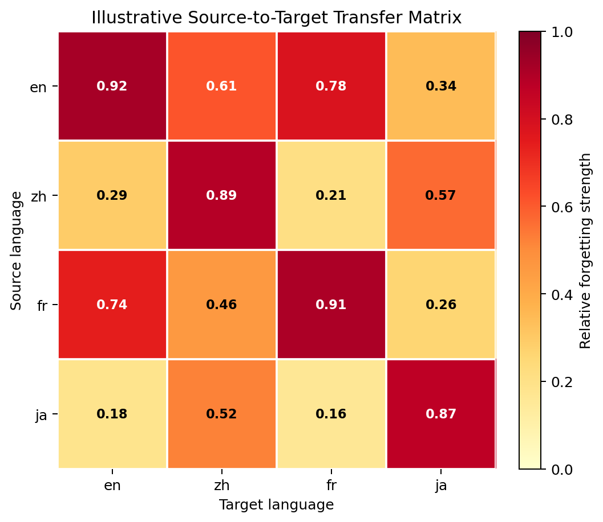
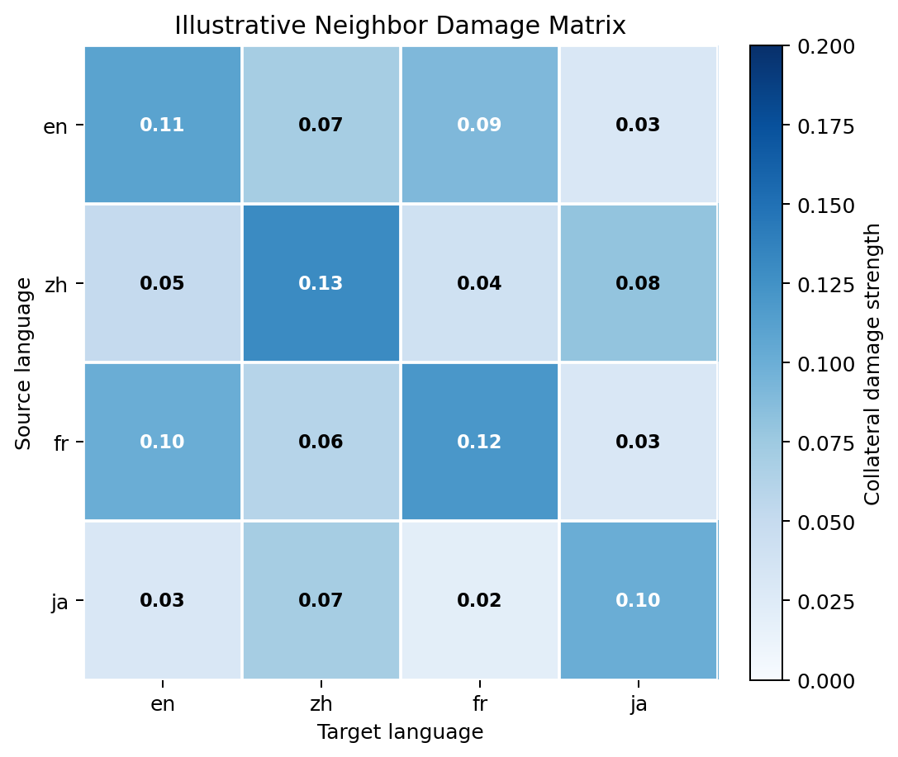

# Cross-Lingual Unlearning Benchmark 项目同步

> 状态说明：本文是早期 pilot 阶段的同步报告。文中旧数据规模保留为历史记录，并用删除线标记；当前 active 数据构造状态以 [../code/data_workflow/README.md](../code/data_workflow/README.md) 为准。

截至 `2026-05-29`，这个项目可以用一句话概括：

> 我们在构建一个 **cross-lingual unlearning benchmark**，核心不是只看某个目标语言上“还能不能答出来”，而是评估 unlearning 方法在 **多语言访问路径** 下实际形成的遗忘边界，以及这个边界是否符合具体任务的预期范围。

为了方便同步，下面按五个问题展开：

1. 为什么要做这个 benchmark  
2. 这个 benchmark 的核心评估逻辑是什么  
3. 支撑 benchmark 的数据是怎么构造出来的  
4. 当前已经做到哪一步  
5. 下一步推进什么

## 1. 为什么要做 Cross-Lingual Unlearning Benchmark

### 1.1 核心问题

现有 unlearning benchmark 大多基于 **单语言访问路径** 来评估遗忘效果，默认假设是：

> 只要模型在目标语言里的标准问法上答不出来，就可以认为相关知识已经被成功遗忘。

这个假设在 multilingual model 中并不稳固。原因是：

- 同一知识可能通过多个语言路径被访问
- 这些路径之间可能共享表示，也可能保留语言特异性的访问通道
- 因此，一个语言中的“答不出来”并不必然意味着这条知识整体上已经不可访问

所以我们真正关心的，不是某一句单语 QA 是否失效，而是：

> 在多语言访问路径下，这条知识的实际遗忘边界到底落在哪里？

### 1.2 单语言 benchmark 看不到什么

如果只看目标语言上的 forget score，就至少会遗漏两类关键信息：

1. `低估跨语言泄露`
   - 目标语言里似乎已经忘了
   - 但其他语言路径仍然可以访问同一知识

2. `忽视不必要的跨语言副作用`
   - 目标知识被删掉了
   - 但其他语言中本应保留的知识或邻近 topic 也被连带误伤

因此，单语言 benchmark 很难区分三种本质不同的情况：

- `真正符合预期边界的遗忘`
- `表面遗忘`
- `过度遗忘`

### 1.3 我们要评估的是什么

我们提出 cross-lingual unlearning benchmark，并不是为了先验规定：

- 所有语言都必须一起遗忘
- 或者遗忘必须永远严格局部化在单一语言里

因为这两种要求只对应不同场景，而不是共同真理。

更准确地说，我们要评估的是：

> 一个 unlearning 方法在多语言访问路径下实际诱导出的遗忘画像，是否与具体任务所要求的预期遗忘范围一致。

这里至少有两类典型场景：

- `common-goals`
  - 目标知识在多个语言中都应该被一起删除
  - 其他语言不应成为逃逸通道

- `culture-specific`
  - 目标知识只应在特定语言或文化语境中被遗忘
  - 其他语言中应尽量保留

这也是为什么我们的 benchmark 采用“两层式评估”。

## 2. Benchmark 的核心评估逻辑

这一部分的核心参考是 [cross-lingual-unlearning-benchmark.md](/Users/qinwei/codespace/multilingual-unlearning-benchmark/research_notes/cross-lingual-unlearning-benchmark.md)。

### 2.1 总体设计

这个 benchmark 不围绕单一 accuracy 或单一 forget score 来组织，而是围绕两个核心视角：

1. `传播拓扑`
   - 遗忘从源语言向其他语言如何传播
   - 是全局、局部、对称还是碎片化

2. `边界控制`
   - 删除目标知识时是否误伤了非目标知识
   - 误伤更偏向 general knowledge 还是 neighbor topics
   - 副作用是否继续向其他语言外溢

换句话说，benchmark 的目标不是直接给方法排一个总分，而是刻画一个方法在 multilingual space 里形成的 **forgetting profile**。

### 2.2 两层式评估框架

#### 第一层：Policy-free profiling

第一层不预设理想策略，只做描述性刻画。它回答的是：

- 目标知识在不同语言上的遗忘强度
- 遗忘是否会从源语言传播到其他语言
- 传播是否具有方向性
- 遗忘是只压制标准问法，还是在表层改写下也稳定
- 删除目标知识时，是否误伤了本来不该忘的内容

这一层的目标是“画像”，不是“裁决”。

#### 第二层：Policy-conditioned evaluation

第二层建立在第一层 profile 之上，在具体场景已经明确时，再判断：

> 这个 forgetting profile 是否符合该场景的策略需求？

例如：

- `common-goals` 更奖励“该传播时能传播”
- `culture-specific` 更奖励“该局部时能局部”

所以第二层不是重新定义 benchmark，而是用第一层的结果去服务具体任务判断。

### 2.3 第一层怎么评：Propagation Topology

第一层里，最核心的对象是 **source-to-target transfer matrix**：

`T_{s->t}`

它表示：

> 在源语言 `s` 上执行 unlearning 后，目标语言 `t` 上目标知识的相对遗忘强度有多大。

这里有三个关键点：

1. 目标知识按“跨语言知识对象”来理解  
   我们测的是同一知识在不同语言路径下是否仍然可访问，而不是某一句英文或中文问法是否失效。

2. 可访问度用平行单语 QA 来测  
   在语言 `t` 上，只用该语言自己的单语 probe，也就是 `core QA` 和 `surface QA`。  
   mixed-language / code-switching / bridge-language 路径不并入主矩阵。

3. `T_{s->t}` 使用相对遗忘强度，而不是绝对分数  
   这样可以减少语言难度差异和翻译质量差异带来的干扰。

为了帮助理解，可以看一个虚拟的 `source-to-target transfer matrix` 例子。这里假设语言集合是 `en`、`zh`、`fr`、`ja`：

| source \\ target | en | zh | fr | ja |
|---|---:|---:|---:|---:|
| `en` | 0.92 | 0.61 | 0.78 | 0.34 |
| `zh` | 0.29 | 0.89 | 0.21 | 0.57 |
| `fr` | 0.74 | 0.46 | 0.91 | 0.26 |
| `ja` | 0.18 | 0.52 | 0.16 | 0.87 |

这个矩阵可以这样读：

- 对角线高，说明各语言自身上的 unlearning 基本有效
- `en -> fr` 较强，说明英文上的遗忘对法语传播明显
- `en -> zh` 强于 `zh -> en`，说明存在方向性
- `ja` 与其他语言之间传播较弱，说明这条路径更局部

因此，读这张矩阵时最重要的是看整个图案，而不是盯某一个数值：

- 对角线是否足够高
- 非对角项整体强不强
- `T_{s->t}` 和 `T_{t->s}` 是否对称
- 同一个 source language 向外传播时，是均匀的还是碎片化的

基于整张 transfer matrix，当前设计重点抽三个摘要指标：

- `Globality / Locality`
  - 遗忘更像全局传播，还是更像局部限制

- `Asymmetry`
  - `T_{s->t}` 和 `T_{t->s}` 是否明显不同

- `Cross-lingual Consistency`
  - 对同一个源语言来说，遗忘向其他语言传播时是否均匀稳定

### 2.4 第一层怎么评：Boundary Control

如果 2.3 关注的是“目标知识怎么传播性遗忘”，那么 2.4 关注的是：

> 在删除目标知识时，算法有没有把影响限制在正确边界之内。

这里 benchmark 显式把非目标知识分成两类：

- `general knowledge`
  - 与目标 topic 没有直接邻接关系
  - 用来衡量广义知识或一般能力保留

- `neighbor topics`
  - 与目标 topic 在语义上接近、结构上相似、容易串扰
  - 用来 stress-test 边界控制能力

这部分默认只用 **core factual QA** 来测 non-target preservation，而不把 surface QA 并入主指标。原因是这里测的是 collateral damage，而不是非目标知识的访问鲁棒性。

基于此，当前设计会构造：

- `general retention`
- `neighbor retention`
- `general damage matrix`
- `neighbor damage matrix`

为了帮助理解，可以看一个虚拟的 `neighbor damage matrix`。这里数值越接近 `0` 越好，表示误伤越小：

| source \\ target | en | zh | fr | ja |
|---|---:|---:|---:|---:|
| `en` | 0.11 | 0.07 | 0.09 | 0.03 |
| `zh` | 0.05 | 0.13 | 0.04 | 0.08 |
| `fr` | 0.10 | 0.06 | 0.12 | 0.03 |
| `ja` | 0.03 | 0.07 | 0.02 | 0.10 |

这张图和前面的 transfer matrix 一起看时，就能更完整地理解一个方法：

- `transfer` 很高、`damage` 也很高
  - 删得广，但副作用大

- `transfer` 适中、`damage` 很低
  - 边界控制更克制

- 某个 source language 对其他语言的 `damage` 更高
  - 说明副作用传播本身也具有方向性

### 2.5 第一层的推荐输出形式

当前 benchmark 默认不追求一个统一总分，更推荐输出：

- `transfer heatmap`
- `damage heatmap`
- `core / surface access-family breakdown`
- `profile radar chart`
- 若干 trade-off 图
  - `target forgetting vs non-target retention`
  - `cross-lingual transfer vs spillover damage`
  - `access robustness vs utility preservation`

一句话说，第一层的职责是：

> 把算法行为画像清楚，而不是压缩成一个单一数字。

### 2.6 第二层怎么评：场景化解释

在第二层里，再根据场景来解释第一层 profile。

#### Common-goals

这类场景奖励的是：

> 该传播时能传播

因此更看重：

- source language 自身 forget 是否充分
- 其他相关语言上是否也能 forget
- residual access 是否低
- forgetting consistency 是否高

#### Culture-specific

这类场景奖励的是：

> 该局部时能局部

因此更看重：

- 目标语言中是否成功 forget
- 非目标语言中是否尽量保留
- containment 是否好
- spillover damage 是否低

## 3. 支撑 Benchmark 的 QA 数据构造思路

这一部分的核心参考是：

- [Unlearning-generation-method.md](/Users/qinwei/codespace/multilingual-unlearning-benchmark/research_notes/Unlearning-generation-method.md)
- [code/data_workflow/README.md](/Users/qinwei/codespace/multilingual-unlearning-benchmark/code/data_workflow/README.md)

### 3.1 总体方法

这个 benchmark 的数据构造采用 **knowledge-first** 思路，而不是 QA-first。

也就是说：

- 先定义可独立访问、可独立遗忘、可独立评测的知识单元
- 再围绕这些知识单元生成 QA probes

主线是：

`Wiki page -> knowledge cards -> relation-matched target/neighbor fact pairs -> English canonical QA -> target-language localized QA`

这里的核心原则是：

> unlearning 的对象是知识，QA 只是访问这条知识的 probe。

### 3.2 按 Step 看 workflow

下面直接按 `Step 1 - Step 7` 来看当前数据构造流程。每一步都回答三件事：

- 这一步在做什么
- 它产出什么
- 当前数据里有什么例子

### 3.3 Step 1：固定 target / neighbor topic pairs

这一步的目标是先定义 benchmark 的比较单元：

- 哪些 topic 是 unlearning target
- 哪些 topic 作为语义邻近但不应被删除的 neighbor

早期 pilot 中曾是 ~~当前已经固定 `6` 组 topic pairs~~。当前 active 数据线已经扩展为：

- common-goals：`50` 组 topic pairs / `100` pages
- culture-specific：`30` 组 topic pairs / `60` pages

下面的 `Star Wars / Star Trek` 只作为历史 pilot 示例保留：

- `pop_culture_space_franchise`
  - target: `Star Wars franchise`
  - neighbor: `Star Trek franchise`

这一步的意义是先把“边界压力”固定下来，后面的知识抽取和 QA 生成都围绕这些 pair 展开。

### 3.4 Step 2：收集对应的 Wikipedia 页面内容

这一步的目标是为每个 target / neighbor topic 固定原始证据来源。

例如在 `pop_culture_space_franchise` 里，对应页面是：

- target page: `Star Wars`
- neighbor page: `Star Trek`

这一步产出的是 pair-structured 的 Wiki 文本，而不是 QA。它保证后续所有 knowledge card 都能回链到统一来源。

### 3.5 Step 3：从 Wiki 页面抽取 knowledge cards

这一步的目标是把页面内容拆成可独立访问、可独立评测的原子事实单元。

一个典型样例是：

- topic: `Star Wars franchise`
- relation_type: `television_series`
- fact_statement: `The first live-action Star Wars series, The Mandalorian, was released in 2019.`
- answer: `The Mandalorian`

这一步的重点是：

- 每张 card 只表达一个核心 relation
- answer 要短、边界清楚
- 必须能回链到 source span

早期 pilot 中曾是 ~~当前 Step 3 总共抽出了 `348` 张 knowledge cards~~。当前 active 输出为：

- common-goals：`2888` 张 knowledge cards
- culture-specific：`1761` 张 knowledge cards

### 3.6 Step 4：构造 relation-matched target / neighbor pairs

这一步的目标不是找“主题相近的问题”，而是找“关系对齐的知识单元”。

例如在当前数据里，有这样一组 pairing：

- target fact:
  - `Star Wars franchise` -> `television_series` -> `The Mandalorian`
- neighbor fact:
  - `Star Trek franchise` -> `television_series` -> `The Next Generation`

它们能配成一对，不是因为都属于“太空科幻”，而是因为问的是同一种 relation：`television_series`。

这一步给后面的 boundary control 提供稳定的 target / neighbor 对照。

早期 pilot 中曾是 ~~当前 Step 4 从 `639` 个候选 pairing 中筛出了 `120` 个最终 knowledge pairs~~。当前 active 输出为：

- common-goals：Step 4 high-recall pool 为 `958` pairs，Step 4.5 正式选中 `500` pairs
- culture-specific：Step 4 strict pool 为 `440` pairs，Step 4.5 正式选中 `300` pairs

### 3.7 Step 5：生成 English canonical QA

这一步的目标是把已经固定好的 knowledge pair 转成英语 probing set，同时保持“一个 QA 只访问一个 knowledge unit”。

继续用上面的 target fact 举例：

- underlying fact:
  - `Star Wars franchise` -> `television_series` -> `The Mandalorian`

对应的英文 `core QA` 可以是：

- Q: `What is the first live-action television series in the Star Wars franchise?`
- A: `The Mandalorian`

对应的英文 `surface QA` 可以是：

- Q: `Which 2019 live-action TV show was the first released for the Star Wars franchise?`
- A: `The Mandalorian`

这里的关键是：

- `core QA` 测最标准的访问路径
- `surface QA` 测同语内部的表层改写鲁棒性
- 两者访问的仍然是同一条基础知识，而不是新的知识

早期 pilot 中曾是 ~~当前 Step 5 已生成 `960` 条 English QA variants~~。当前 active 输出为：

- common-goals：`4000` 条 English canonical QA variants
- culture-specific：`2400` 条 English canonical QA variants

### 3.8 Step 6：扩展到目标语言的平行单语 QA

这一步的目标不是让每种语言重新发明一套问题，而是围绕同一条 English canonical QA 做 translation + localization。

继续用同一条知识举例，在中文里对应的 `core QA` 可以是：

- Q: `星球大战系列的第一部真人电视剧是什么？`
- A: `曼达洛人`

对应的中文 `surface QA` 可以是：

- Q: `设定在星球大战宇宙中的第一部真人剧集叫什么名字？`
- A: `曼达洛人`

这里最关键的是：

- 变的是语言
- 不变的是 `source_qa_id` 所对应的知识单元、relation 和 variant layer

早期 pilot 中曾是 ~~当前 Step 6 已完成一轮中文扩展，生成了 `960` 条中文 QA variants~~。当前 active 输出为：

- common-goals：已生成 `ar,bn,de,es,fr,ja,sw,th,zh` 9 个非英语语言文件，每个 `4000` 条 accepted QA
- culture-specific：已生成 `ar,bn,de,es,fr,ja,sw,th,zh` 9 个非英语语言文件，每个 `2400` 条 accepted QA

### 3.9 Step 7：做最终质检和发布筛选

这一步的目标是把前面的生成结果从“已跑通”推进到“可发布”。

当前 Step 7 的检查重点包括五层：

- topic 层
- knowledge card 层
- pair 层
- English canonical QA 层
- multilingual QA 层

如果还用上面的例子来理解，Step 7 要检查的就是：

- 这条 `The Mandalorian` 的 card 是否真的只表达一个 relation
- 它和 `The Next Generation` 的 pairing 是否合理
- 英文 `core / surface` 是否仍然在问同一知识
- 中文 `core / surface` 是否仍然忠实对应同一个 `source_qa_id`

目前 Step 7 的规则框架已经写出，但还没有形成最终自动化 review pipeline。

### 3.10 为什么主 benchmark 不纳入 mixed-language QA

当前默认不把下面这些 probe 放进主 QA variants：

- code-switching
- query / answer language mismatch
- bridge-language recovery
- mixed-language prompting

原因是，一旦把这些路径直接并入主 QA 集合，评估目标就会从：

- `clean monolingual access 下的 cross-lingual transfer`

变成：

- `transfer + adversarial escape path`

这会让 benchmark 主线失焦。

所以当前更稳妥的定位是：

- 主 benchmark：平行单语 QA
- mixed-language recovery：后续 stress test / future work

## 4. 当前数据 workflow 与实际进度

### 4.1 当前固定的 topic pairs

早期 pilot 中曾固定 ~~`6` 组 target / neighbor pairs~~：

| Pair ID | Target | Neighbor |
|---|---|---|
| ~~`pop_culture_space_franchise`~~ | ~~Star Wars franchise~~ | ~~Star Trek franchise~~ |
| ~~`space_milestone_missions`~~ | ~~Apollo 11~~ | ~~Vostok 1~~ |
| ~~`renaissance_artists`~~ | ~~Leonardo da Vinci~~ | ~~Michelangelo~~ |
| ~~`medical_discoveries`~~ | ~~Penicillin~~ | ~~Insulin~~ |
| ~~`mythology_systems`~~ | ~~Greek mythology~~ | ~~Norse mythology~~ |
| ~~`beverage_companies`~~ | ~~The Coca-Cola Company~~ | ~~PepsiCo~~ |

当前 active topic pair 口径为：

| 数据线 | 当前规模 | 设计文档 |
|---|---:|---|
| common-goals | `50` pairs / `100` pages | [../code/data_workflow/topic-pair-summary.md](../code/data_workflow/topic-pair-summary.md) |
| culture-specific | `30` pairs / `60` pages | [../code/data_workflow/culture-specific-topic-pair-summary.md](../code/data_workflow/culture-specific-topic-pair-summary.md) |

### 4.2 当前主线推进到哪

早期 pilot 中曾记录为 ~~data construction 主线已经推进到 Step 6~~：

| Step | 状态 | 当前结果 |
|---|---|---|
| Step 1 topic pair design | ~~已完成~~ | ~~固定 `6` 组 topic pairs~~ |
| Step 2 wiki collection | ~~已完成~~ | ~~已生成 `data/wiki_page_content.json`~~ |
| Step 3 knowledge card extraction | ~~已完成~~ | ~~抽出 `348` 张 knowledge cards~~ |
| Step 4 relation-matched pairing | ~~已完成~~ | ~~从 `639` 个候选 pairing 中筛出 `120` 个最终 pairs~~ |
| Step 5 English canonical QA | ~~已完成~~ | ~~生成 `960` 条 English QA variants~~ |
| Step 6 Chinese localization | ~~已完成~~ | ~~生成 `960` 条中文 QA variants~~ |
| Step 7 quality review | ~~框架已写~~ | ~~还没有固定自动化脚本和最终 reviewed release~~ |

当前 active 主线已经拆成 common-goals 与 culture-specific 两条数据线：

| 数据线 | 当前状态 | 关键结果 |
|---|---|---|
| common-goals | Step 1-6 已跑通；Step 7 仍是质检/发布筛选层 | 50 topic pairs；2888 cards；Step 4.5 选中 500 pairs；4000 English QA；9 个非英语语言各 4000 accepted QA |
| culture-specific | Step 1-6 已跑通，并完成抽样翻译质量审核；Step Houldout 已生成 | 30 topic pairs；1761 cards；Step 4.5 选中 300 pairs；2400 English QA；9 个非英语语言各 2400 accepted QA |

### 4.3 当前数据规模

早期 pilot 的 Step 3 knowledge card 分布如下，当前已过期：

| Pair ID | Target cards | Neighbor cards |
|---|---:|---:|
| ~~`pop_culture_space_franchise`~~ | ~~30~~ | ~~29~~ |
| ~~`space_milestone_missions`~~ | ~~29~~ | ~~30~~ |
| ~~`renaissance_artists`~~ | ~~30~~ | ~~30~~ |
| ~~`medical_discoveries`~~ | ~~30~~ | ~~23~~ |
| ~~`mythology_systems`~~ | ~~30~~ | ~~29~~ |
| ~~`beverage_companies`~~ | ~~28~~ | ~~30~~ |
| ~~**Total**~~ | ~~**177**~~ | ~~**171**~~ |

早期 pilot 中曾是 ~~Step 4 最终固定为每个 topic pair `20` 个 relation-matched pairs~~，因此：

- ~~`120` 个 knowledge pairs~~
- ~~`240` 张进入 QA 阶段的 fact cards~~

当前 Step 5 配置是：

- 每张 card `1` 条 core QA
- 每张 card `3` 条 surface QA

所以早期 pilot 英语 canonical QA 总数为：

- ~~`240 x 4 = 960`~~

早期 pilot 中曾是 ~~Step 6 已完成一轮中文扩展~~，因此当时只有：

- ~~`data/qa_variants.en.json`~~
- ~~`data/qa_variants.zh.json`~~

当前 active 数据规模应改按 Step 4.5 selected pairs 计算：

- common-goals：`500` selected pairs -> `1000` fact cards -> `4000` English QA variants；9 个非英语语言各 `4000` accepted QA
- culture-specific：`300` selected pairs -> `600` fact cards -> `2400` English QA variants；9 个非英语语言各 `2400` accepted QA

### 4.4 当前阶段如何定位

当前项目最准确的状态是：

- `benchmark construction pipeline` 已经基本打通
- `benchmark evaluation logic` 已经比较明确
- 但 `reviewed release` 和 `自动化评测 workflow` 还没有完全落地

早期 pilot 阶段最成熟的是：

> ~~从 topic pair 一直到 bilingual QA 的 supporting data pipeline~~

当前 active 状态已经扩展到：

> 从 topic pair 到 English canonical QA，再到 9 个非英语语言的 parallel monolingual QA supporting data pipeline

而不是：

> 一整套已经 fully frozen 的 benchmark release + baseline evaluation system

## 5. 下一步建议

如果接下来要和合作者对齐优先级，我觉得最值得讨论的是三件事：

1. 先完成 Step 7 review，形成第一版 reviewed release
2. 先把第一层 evaluation profile 落成可执行 workflow
3. 继续扩更多目标语言，把真正的 cross-lingual 分析做起来

如果要给一个更稳妥的顺序，我会建议：

1. `先补 Step 7 review`
2. `再落地第一层 evaluation outputs`
3. `然后扩更多语言并开始 baseline experiments`

## 6. 一句话总结

这个项目当前最准确的定位是：

> 我们正在构建一个以 multilingual forgetting profile 为核心的 cross-lingual unlearning benchmark。它的重点不是单语 forget score，而是刻画遗忘如何在语言空间中传播、是否具有清晰边界，以及这些行为在 common-goals 和 culture-specific 场景下是否符合策略需求。早期 pilot 曾是 ~~从 6 组 topic pairs 打通到 English canonical QA 和 Chinese localized QA~~；当前 active 数据线已经扩展为 common-goals 50 组、culture-specific 30 组，并打通到 9 个非英语语言的 parallel monolingual QA。下一阶段的重点是质检冻结、评测落地和发布口径收敛。

## 7. 需要进一步确认的 5 个讨论点

### Q1. 主 benchmark 应该继续使用真实 Wiki 数据，还是改成全虚构数据？

- `真实 Wiki 数据` 的优点是更贴近真实知识和真实 unlearning 场景。
- `虚构数据` 的优点是更可控，可以模拟理想 forget / retain 边界，也更容易做诊断实验。
- 当前更自然的讨论方向是：
  - 主 benchmark 继续用真实数据？
  - 是否额外补一个小规模虚构数据集？

模型发布后的实体「books」：

### Q2. 当前数据量是否足够？是否需要增加 topic pairs 或 knowledge card pairs？

- 早期 pilot 规模大致是：
  - ~~`6` 个 topic pairs~~
  - ~~每个 pair `20` 个 relation-matched knowledge pairs~~
  - ~~共 `120` 个 knowledge pairs~~
  - ~~共 `240` 张 fact cards~~
  - ~~每种语言共 `960` 条 QA variants~~

- 当前 active 规模大致是：
  - common-goals：`50` 个 topic pairs，`500` 个 selected knowledge pairs，`4000` 条 English QA variants，每个非英语语言 `4000` 条 translated QA
  - culture-specific：`30` 个 topic pairs，`300` 个 selected knowledge pairs，`2400` 条 English QA variants，每个非英语语言 `2400` 条 translated QA

- 从 unlearning 训练数据的角度看，如果只用 target-side 的 `core QA` 作为 forget training set，那么早期 pilot 中 ~~当前在 `6` 个 topic 上可用于某一语言 unlearning 的训练数据量大约是 `120` 条~~。当前 common-goals 对应约 `500` 条 target-side core QA；culture-specific 对应约 `300` 条 target-side core QA。

200 或者400 训练 QA；

- 从评估数据的角度看，早期 pilot 曾按每一类各包含：
  - ~~`120` 条 `core QA`~~
  - ~~`240` 条 `QA variants`~~

  并同时评估 `target`、`neighbor`、`general` 三类，那么总评估规模可写成：
general 会少一点。
  ~~`（120 + 240） x 2 x n + general = `~~

  其中 `n` 是语言数量。

- 这套规模足够做 pilot，但如果要做更稳的 benchmark，可能还是偏小。
- 当前需要确认的是：
  - 第一版是做 pilot 还是正式 benchmark
  - 如果扩数据，是优先扩 `topic pairs`，还是扩每组的 `knowledge pairs`

### Q3. 是否需要支持 completion 形式的评测？

- 现有数据保留了 source span，因此技术上可以支持 completion 评测。
- completion 的优点是更接近语言模型原生生成行为；缺点是更容易混入续写习惯，解释会更复杂。
- 当前要确认的是：
  - completion 要不要做
  - 如果做，是进入主 benchmark，还是作为独立附加轨道

不用；

### Q4. 一共需要支持多少语言？

- 当前实际已完成的是 `en` canonical QA 和 `zh` localized QA。
- 语言太少，matrix 分析价值有限；语言太多，构造和质检成本会上升很快。
- 当前要确认的是：
  - 第一版是先做少数代表性语言，还是直接追求更广覆盖
  - 哪几种语言最值得优先支持
  - 大模型建议：en zh fr es ja ar

### Q5. 第一版需要评估哪些 unlearning 方法？

- 当前要确认的是：
  - 第一版是先做少量典型方法，还是尽量铺更多方法
  - 哪些方法最能体现 cross-lingual transfer 和 damage profile 的差异

GA、GD、NPO

Open Unlearning
